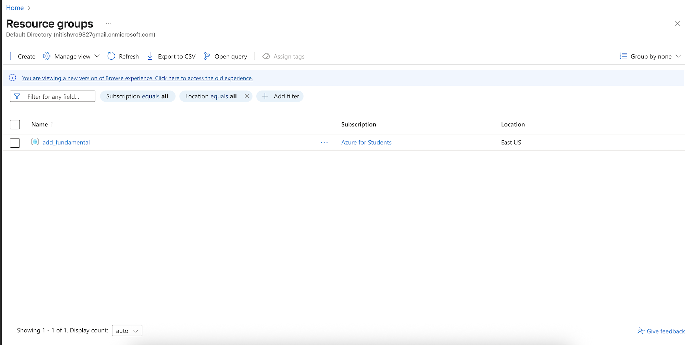
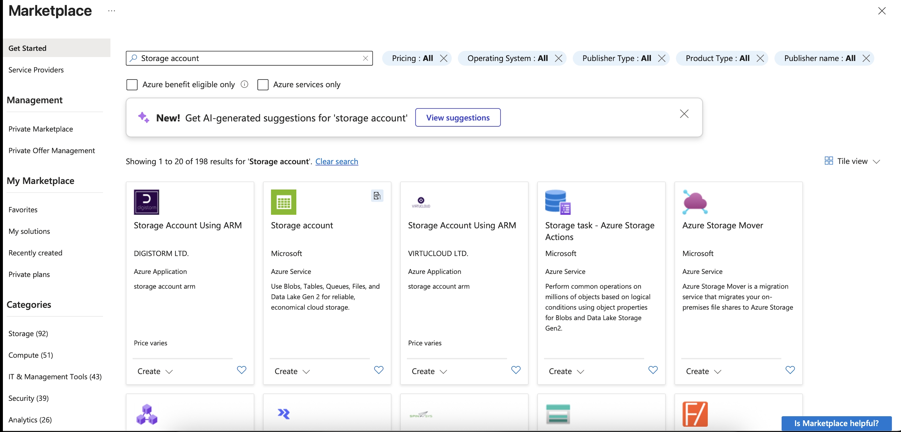
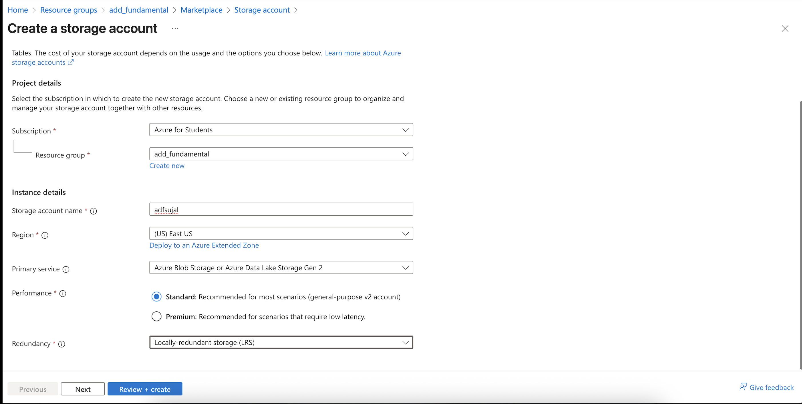
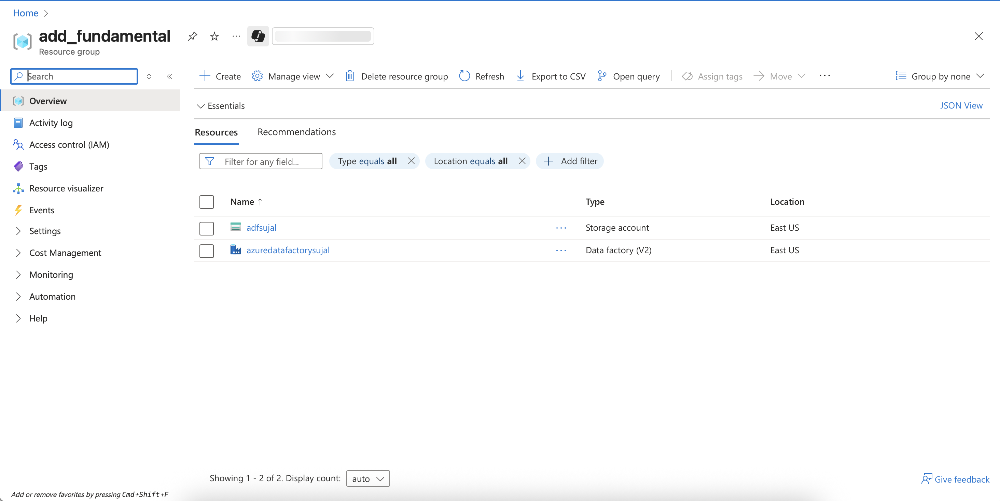

Azure Data Factory  🚀

📌 Overview:
This repository documents my hands-on learning with Azure Data Factory (ADF), covering data migration within Azure Cloud and data ingestion from external APIs using HTTP linked services.
The project follows a step-by-step approach, including setup, dataset creation, pipelines, and activities.

Azure Data Factory (ADF) is Microsoft’s cloud-based ETL (Extract, Transform, Load) and data integration service.
It allows you to:
- Build and orchestrate data pipelines without heavy coding
- Connect to on-premises, cloud, and SaaS data sources
- Ingest, transform, and migrate data across services like Azure Blob, Data Lake, SQL, and REST APIs
- Automate workflows with scheduling and monitoring tools
In short: ADF is the backbone for moving and shaping data inside Azure’s ecosystem.

⚙️ Key Concepts:
- Azure Data Factory (ADF): ETL service for building data pipelines
- Data Lake: Centralized storage for structured & unstructured data
- Linked Service: Connection to external data sources (Blob, SQL, API, etc.)
- Dataset: Representation of data within pipelines
- Copy Activity: Move data from source to destination
- REST API Integration: Fetching external data via HTTP linked service

🏗️ Steps Implemented
1. Azure Setup
 - Created a free Azure Account
 - Provisioned Azure Data Lake storage
 - Created Data Factory Workspace

2. Pipeline Creation
 - Added Linked Services for Blob, SQL DB, and REST API
 - Defined Datasets for source & destination
 - Designed a pipeline for Copy Activity

3. Data Migration
 - Migrated data within Azure Cloud (Blob → Data Lake → SQL)
 - Configured schedule triggers for automation

4. API Data Ingestion
 - Created HTTP Linked Service
 - Pulled JSON data from REST API
 - Stored results into Data Lake

📸 Screenshots
Azure Portal – Data Factory Workspace
- step 1: create the reouce and then add service into it storage account and azure data factory

 and make sure to use azure data lake gen 2 Enable the hierarchical namespace 

Azure Data Factory service

see we have 2 service in resource group

- step 2: create the container in storage account for moveing data source to destination:

then add  file in source directory (Fact.Sales.csv in my scenario)

Linked Service Creation

- setp 3: After That work with ADF lunch the azure data factory as we saw above, we see many interface of the adf
  go to manage tab then in connection section you will se the linked service create it to connect with adf
  ADLS for migration and HTTP for api data fetch 2 types of linked service we have in out implementation

create the adls(azure data lake service gen 2) 

then create the source data format type in my case i have .csv so i choose delimetertext

config the source tab select the source path

config the sink tab(where to migrate data) select the destination path same step as we follow above 

after completeing this we can run the pipeline and see the output of first mini migration

see the destination of storage 

Step 4: same action for fetch data from api use http linked service
 
 
 
 
 

📚 Resources
 - [microsoft docs](https://learn.microsoft.com/en-us/azure/data-factory/)
 - [Ansh Lamba YT ](https://www.youtube.com/watch?v=8zIVOdKyoDA&t=4241s)

🚀 Future Work
 - Add Data Transformation activities
 - Automate pipelines with CI/CD (GitHub Actions + ADF)
 - Explore Mapping Data Flows in ADF

